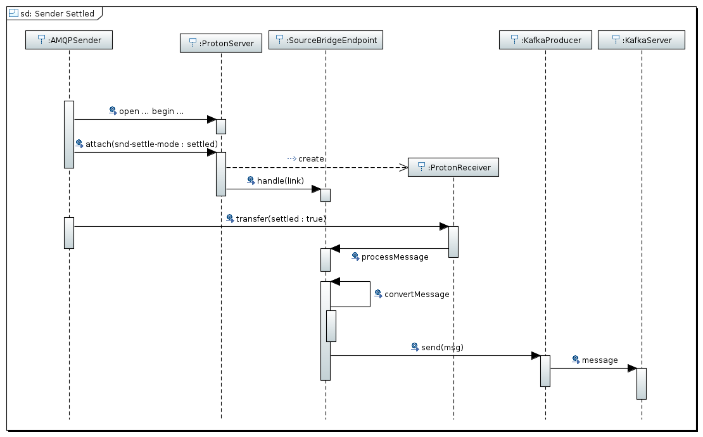
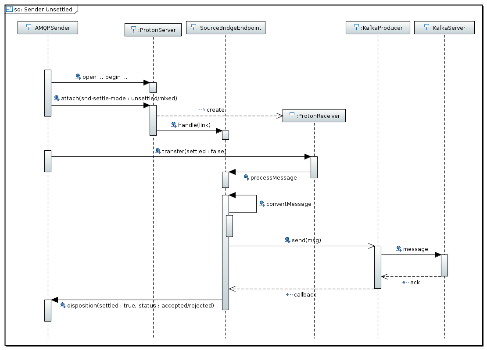

Following the Sequence Diagrams for the sending operation by AMQP sender clients.

## Sender : settled mode

In this scenario the AMQP sender specifies the `snd-settle-mode` as `settled` on link attachment so it will send every message with the settled flag to `true`. The internal AMQP receiver link uses prefetching for flow control and the corresponding link credits are configurable using the bridge.properties configuration file. Receiving each message through the receiver link, the source bridge endpoint sends the message itself to the Kafka server using the internal Kafka Producer which is configured to use `acks` parameter with value `0` so that it doesn't wait for any feedback from the Apache Kafka server. We can consider it an AT MOST ONCE delivery.

## Sender : unsettled mode

In this scenario the AMQP sender specifies the `snd-settle-mode` as `unsettled` on link attachment so it will send every message with the settled flag to `false`. The internal AMQP receiver link uses no prefetch but manual flow control and it means that for each acknowledgement received from the Kafka server (through the internal Kafka Consumer), it updates the link credits accordingly. Receiving each message through the receiver link, the source bridge endpoint sends the message itself to the Kafka server using the internal Kafka Producer which is configured to use `acks` parameter with value `1` or `all` so that it waits acknowledgement from Kafka server (if message is got only by leader or by all related replicas). It means that it waits for an acknowledgment in order to send a disposition with info on message settled and the related delivery status (ACCEPTED or REJECTED).

## Sender : mixed mode

In this scenario the AMQP sender specifies the `snd-settle-mode` as `mixed` so it can mix the above behavior for each single message.
The internal AMQP receiver link is configured as the "unsettled mode" with manual flow control due to different behavior for each message.

## Sender : flow control

The flow control related to the traffic from AMQP senders to Apache Kafka is handled in two different ways based on requested QoS :

* AT MOST ONCE : AMQP senders send pre-settled messages and in that case the internal AMQP receiver uses _prefetch_ feature for granting credits to the sender. In this scenario, there is no acknowledgment from Kafka server so the throughput can be considered not a problem;
* AT LEAST ONCE : AMQP senders send messages not already settled and in that case the internal AMQP receiver grants a number of credits (configurable). In this scenario, the internal endpoint needs to receive acknowledgment from Kafka server before sending flow message to the AMQP sender in order to grant new credits;
